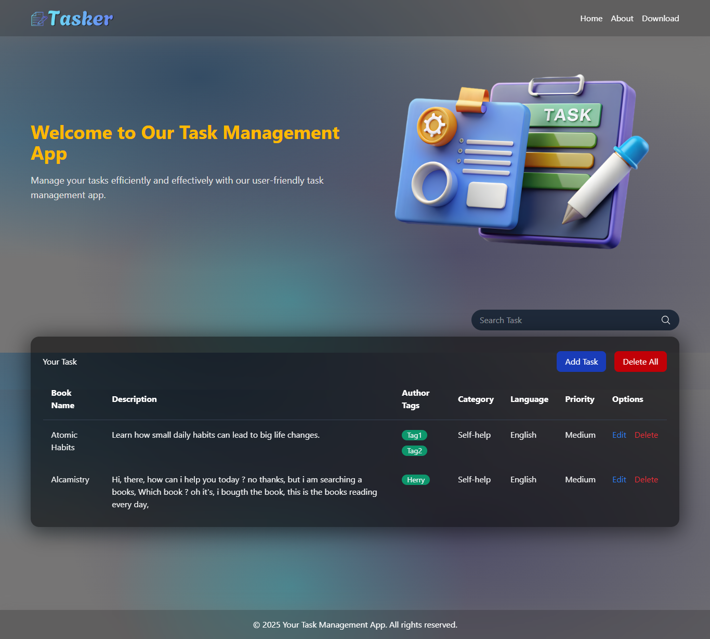
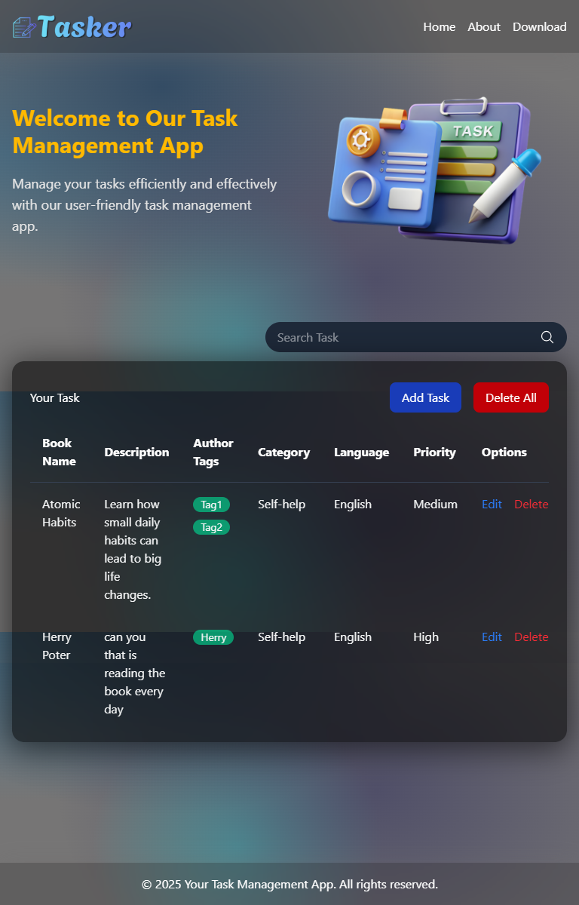
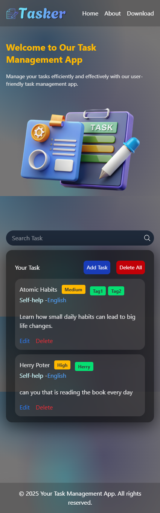

<<<<<<< HEAD

=======
# Tasker App :memo:

#### A modern task management app to create, edit, organize, and track your tasks efficiently.

 

## 📸 Screenshots

| [Desktop](./src/assets/Screenshot/desktop.png)  | [Tablet](./src/assets/Screenshot/tablet.png)  | [Mobile](./src/assets/Screenshot/mobile.png)  |
| ----------------------------------------------- | --------------------------------------------- | --------------------------------------------- |
|  |  |  |

 

## ✨ Features

- #### 📝 Add, Edit, and Delete tasks
- #### 🏷️ Tag-based organization
- #### 🚦 Priority filter (High, Medium, Low)
- #### 🌐 Multi-language support
- #### 📱 Fully responsive on all devices
- #### 🔎 Real-time search and filter
 

## 🛠️ Tech Stack

- **Frontend :** React, Vite, Tailwind CSS

- **State Management :** Context API

- **Deployment :** Vercel
   
   
   

## 👨‍💻 Getting Started

### Clone the project and install dependencies :

#### Terminal Git Clone

<pre>https://github.com/DevStackSakib/Tasker-app.git</pre>
<pre>cd Tasker-app</pre>
<pre>npm install</pre>
<pre>npm run dev</pre>

>>>>>>> fb78db8 (Now we are adding two file like Footer.jsx and README.md)
